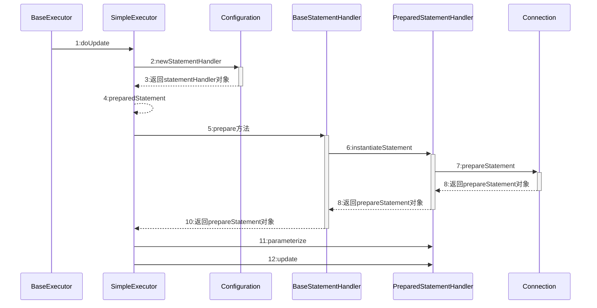

## 总体设计

通过SqlSession.getMapper(XXXMapper.class)方法，MyBatis 会根据相应的接口声明的方法信息，通过动态代理机制生成一个Mapper 实例。我们使用Mapper 接口的某一个方法时，MyBatis 会根据这个方法的方法名和参数类型，确定Statement Id，底层还是通过SqlSession.select("statementId",parameterObject);或者SqlSession.update("statementId",parameterObject); 等等来实现对数据库的操作。

### 层级结构

主要的核心部件解释如下：

- `SqlSession` 作为MyBatis工作的主要顶层API，表示和数据库交互的会话，完成必要数据库增删改查功能

- `Executor` MyBatis执行器，是MyBatis 调度的核心，负责SQL语句的生成和查询缓存的维护

- `StatementHandler` 封装了JDBC Statement操作，负责对JDBC statement 的操作，如设置参数、将Statement结果集转换成List集合

  - **RoutingStatementHandler**：只是根据StatementType 来创建一个代理，代理的就是对应Handler的三种实现类。
  - **BaseStatementHandler**: 是 StatementHandler 接口的另一个实现类.本身是一个抽象类.用于简化StatementHandler 接口实现的难度,属于**适配器设计模式**体现，它主要有三个实现类
    - **SimpleStatementHandler**: 管理 Statement 对象并向数据库中推送不需要预编译的SQL语句
    - **PreparedStatementHandler**: 管理 Statement 对象并向数据中推送需要预编译的SQL语句
    - **CallableStatementHandler**：管理 Statement 对象并调用数据库中的存储过程

- `ParameterHandler` 负责对用户传递的参数转换成JDBC Statement 所需要的参数

- `ResultSetHandler` 负责将JDBC返回的ResultSet结果集对象转换成List类型的集合

- `TypeHandler` 负责java数据类型和jdbc数据类型之间的映射和转换

- `MappedStatement` MappedStatement维护了一条`<select|update|delete|insert>`节点的封装，即对应一条xml的配置文件

- `SqlSource` 负责根据用户传递的parameterObject，动态地生成SQL语句，将信息封装到BoundSql对象中，并返回

- `BoundSql` 表示动态生成的SQL语句以及相应的参数信息

- `Configuration` MyBatis所有的配置信息都维持在Configuration对象之中

## 初始化流程

由上图所示，mybatis初始化要经过简单的以下几步：

- 调用SqlSessionFactoryBuilder对象的build(inputStream)方法；
- SqlSessionFactoryBuilder会根据输入流inputStream等信息创建XMLConfigBuilder对象；
- SqlSessionFactoryBuilder调用XMLConfigBuilder对象的parse()方法；
- XMLConfigBuilder对象返回Configuration对象；
- SqlSessionFactoryBuilder根据Configuration对象创建一个DefaultSessionFactory对象；
- SqlSessionFactoryBuilder返回 DefaultSessionFactory对象给Client，供Client使用。

## Sql执行流程

### 更新执行流程

## MapperProxy

## Excuter

## 拦截器核心对象

mybatis拦截器可以对下面4种对象进行拦截：

1、`Executor`：mybatis的内部执行器，作为调度核心负责调用`StatementHandler`操作数据库，并把结果集通过`ResultSetHandler`进行自动映射(update, query, flushStatements, commit, rollback, getTransaction, close, isClosed)

2、`StatementHandler`： 封装了`JDBC Statement`操作，是sql语法的构建器，负责和数据库进行交互执行sql语句(prepare, parameterize, batch, update, query)

3、`ParameterHandler`：作为处理sql参数设置的对象，主要实现读取参数和对`PreparedStatement`的参数进行赋值(getParameterObject, setParameters)

4、`ResultSetHandler`：处理`Statement`执行完成后返回结果集的接口对象，mybatis通过它把`ResultSet`集合映射成实体对象(handleResultSets, handleOutputParameters)

## 面试题

### mybatis自增主键返回给对象如何实现？

通过last_insert_id 查询插入id值，然后根据插入的条数以及自增的步进倒推id值，因为mysql的自增锁特性保证了一次插入的id值连续。

### mybatis事务如何管理？

通常spring模块会使用其自带的事务管理器来处理事务问题。

### mybatis批量插入sql导致服务cpu占用过高？ 

mysql驱动中默认使用客户端预编译行为，驱动中客户端预编译是在本地服务进行预编译，编译结果会缓存在本地，提高执行效率。但是动态sql的缓存一般是没法命中的，预编译时间长，并且过量占位符的替换也会给系统带来负担导致cpu升高。

useServerPrepStmts=true mysql连接中增加此参数可以使驱动执行mysql的Server端的预编译及缓存，可以酌情使用。

以上缓存的作用域均为**某个单独的连接**。

### 如何实现一个开关来切换数据源？

extends AbstractRoutingDataSource 重写 determineCurrentLookupKey方法